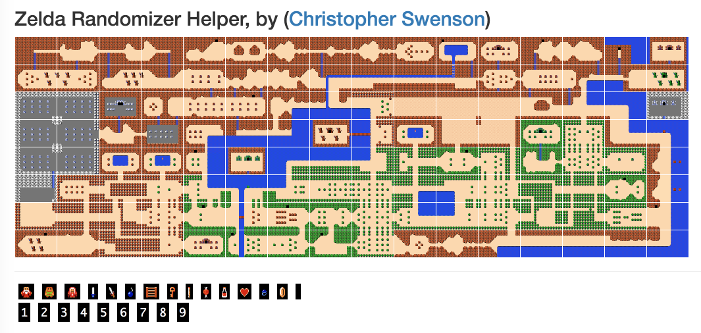

# zelda-randomizer-helper

Use it at https://swenson.github.io/zelda-randomizer-helper/

This is an interactive map for playing randomized versions of The Legend of Zelda
to help you keep track of where levels are, what you are blocked on,
where items to go back for might, etc.

It is a simple JavaScript application.

